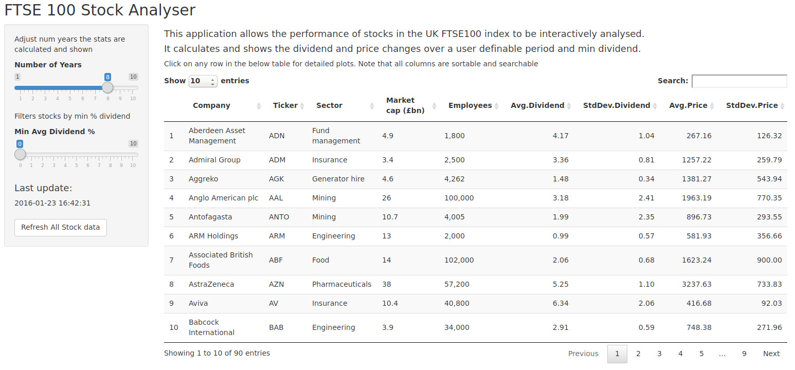

FTSE100 Stock Analyser Shiny App Overview
========================================================
author: Danny Andersen 
date: 24 January 2016

Introduction
========================================================

Analysing company stocks quoted on the stock market can be complex. The 
approach taken very much depends on your investment strategy:

- Short term price gain
- Medium to Long term growth
- Stock Yield through dividend payout

The FTSE100 stock analyser Shiny app takes the latter approach, to determine whether a stock
has a historically good and stable dividend compared to its stock price. It also gives an indication as to whether the stock price is a good reflection of its yield.  

<small>Try it now: https://danny-andersen.shinyapps.io/ftse-stock-analyser/</small>

When to buy, when to sell
========================================================

<small>The analyser app shows the long term price history for a selected stock. 
Consider the plot below that shows a stock price over the last 8 years. Is now a good time to buy? If you were after medium to long term growth then potentially yes but short term looks risky.</small>

<small>The length of time over which to plot the data can be adjusted in the app using a slider. </small>

Long term yield
========================================================
<small>The app calculates the average yield from this stock based on the number of years selected by the user. The app also plots the historical dividend to determine its stability and whether it reflects a historically good long term investment. A user may also select the number of years the statistics are calculated over.</small> 

<small>Past performance is no guarantee of future performance!</small>

The Shiny app
================
<small>The FTSE100 analyser application allows a user to interactively select and plot graphs by selecting from a sortable and searchable table of FTSE100 index stocks. Stocks can also be refreshed and filtered by minimum yield in the app by the easy to use controls</small>

<small>Try it now: https://danny-andersen.shinyapps.io/ftse-stock-analyser/
</small>
